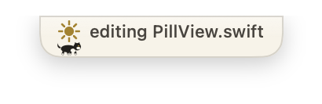
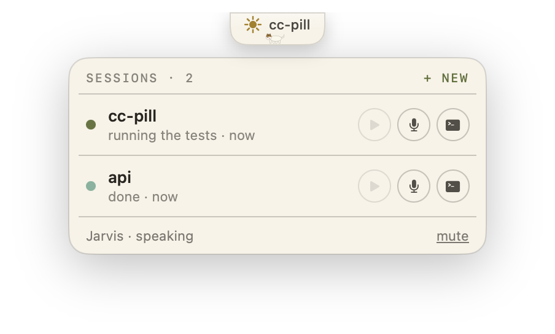
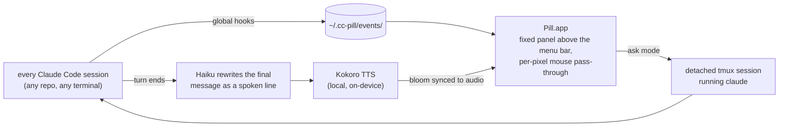

<div align="center">

<picture>
  <source media="(prefers-color-scheme: dark)" srcset="docs/hero-night.png">
  
</picture>

# cc-pill

**A living menu bar for [Claude Code](https://claude.com/claude-code).**

A Dynamic Island style pill floats over your macOS menu bar showing every Claude Code session on the machine. Two tiny cats take laps while Claude works, a paw taps the screen when Claude needs you, and a local neural voice speaks a short, personality-driven briefing when each turn finishes. Press a hotkey, ask for something in plain language, and a hands-free session spins up in the background and reports back out loud.

*Built for people who run Claude Code while doing other things.*


</div>

---

cc-pill grew out of running [Moon Kiln](https://moonkiln.com), my handmade clay store, with Claude Code: answering customers, managing orders, printing shipping labels, updating the storefront, planning the work in Linear. Sessions run all day while my hands are busy with clay, and I wanted to know what Claude was up to, and be asked for what it needs, without sitting at a screen. So: a pill that watches every session, cats that tell me at a glance that work is happening, and a voice that briefs me when something finishes.

## The island

The pill is hidden when nothing is running. Its appearance IS the signal. Porcelain by day, kiln by night, following your system appearance with a crossfade.

<table align="center">
  <tr>
    <td align="center" width="33%">
      <br>
      <sub><b>Resting.</b> Sun or moon, one dot per session. Slim enough to live inside the menu bar.</sub>
    </td>
    <td align="center" width="33%">
      <br>
      <sub><b>Working.</b> Live narration of what Claude is doing, and the cats take laps.</sub>
    </td>
    <td align="center" width="33%">
      <br>
      <sub><b>Needs you.</b> Amber ping, and a paw taps the screen from under the pill.</sub>
    </td>
  </tr>
  <tr>
    <td align="center">
      <br>
      <sub><b>Briefing.</b> The pill blooms as the voice starts, words paced to the audio.</sub>
    </td>
    <td align="center">
      <br>
      <sub><b>Turn-end moments.</b> A star pop for good news, an ears-back walk-off for failures.</sub>
    </td>
    <td align="center">
      <br>
      <sub><b>Night.</b> Kiln tones, crescent moon, and an ember breathing behind the cats.</sub>
    </td>
  </tr>
</table>

<div align="center">
  <picture>
    <source media="(prefers-color-scheme: dark)" srcset="docs/card-night.png">
    
  </picture><br>
  <sub><b>The card.</b> Hover the pill to peek, click to pin. One row per session with replay-briefing, speak-a-prompt, and open-terminal buttons.</sub>
</div>

## What it does

- **Session island.** Every Claude Code session on the machine, keyed by real lifecycle hooks, with dead sessions reaped automatically. SSH sessions are tagged.
- **Live narration.** While Claude works the pill alternates between the project name and what Claude is doing right now ("editing worker.py", "running the tests", "using GitHub"), with elapsed minutes on long turns.
- **Needs-you paw.** Real permission prompts get the amber ping and the paw. Idle "waiting for input" nags are filtered out.
- **Spoken briefings.** Your named assistant (default: Jarvis) speaks a 1-3 sentence summary when a turn ends. Never a transcript: code, paths, and IDs are described in plain speech, and the persona is yours to choose or generate. Local TTS ([Kokoro](https://github.com/thewh1teagle/kokoro-onnx)), summarized by Haiku through your existing Claude Code login. If your music is playing, it ducks, speaks, and resumes.
- **Courtesy layer.** Silent (text-only bloom) when you are already looking at that session's terminal. Silent for SSH sessions. Re-orients you ("On the api work, ...") when the last briefing you heard was a while ago or from another project.
- **Ask mode.** <kbd>⌥</kbd><kbd>⌘</kbd><kbd>M</kbd> anywhere: the pill becomes a prompt. Speak or type, hit <kbd>Enter</kbd>, and a detached Claude session starts in your configured directory (permission mode of your choosing, optional extra system instructions), works, and briefs you out loud when done. Idle pill-launched sessions are garbage collected after 30 minutes.

## Install

```sh
git clone https://github.com/ambasoma/cc-pill
cd cc-pill
./setup.sh
```

Setup is a [gum](https://github.com/charmbracelet/gum) powered interactive TUI (with a plain prompt fallback). It asks where to install, which terminal you use, your ask-mode hotkey, how hands-free pill-launched sessions should be (auto-accept edits by default, fully hands-free or normal prompting if you prefer), and whether you want the voice. Saying yes to the voice adds the voice picker (with live previews), your assistant's name, its personality (presets, your own text, or described-and-generated by Haiku), and the summarizer model.

It then builds the app, installs a launchd agent (starts at login, auto-restarts if killed), registers the Claude Code hooks globally, and optionally adds a tmux wrapper for your interactive sessions so the pill can talk to them.

> [!TIP]
> Not sure about the voice? Say no. The install stays small and silent, and `./setup.sh voice` adds the whole voice system any time later.

### Requirements

- macOS 14+ on Apple Silicon
- [Claude Code](https://claude.com/claude-code) installed and logged in
- Xcode command line tools (`xcode-select --install`)
- Homebrew (setup installs `tmux`, `jq`, and `gum`; `media-control` optional for audio ducking)

> [!NOTE]
> No Xcode project, no code signing, no accounts. Everything runs locally; the only network calls are your own Claude Code sessions and the one-time voice model download (~350MB, only if you enable the voice).

## Controls

| Control | What it does |
| --- | --- |
| Your chosen hotkey (default <kbd>⌥</kbd><kbd>⌘</kbd><kbd>M</kbd>) | Ask mode: start a new session by voice or text. Press again to send, <kbd>Esc</kbd> to cancel. |
| Hover the pill | Peek the session card; click to pin it open. |
| `<yourname>` in the shell | Alias created by setup: `mute`, `on`, `stop`, `last` (replay briefing), `say <text>`, `voice <name>`, `vol`, `speed`. |

## How it works



Hooks write tiny JSON events, the app watches the directory and animates, and the voice worker turns final messages into speech. Ask mode spawns claude in a detached tmux session and delivers your prompt once the TUI is ready; from there it is tracked like any other session.

<details>
<summary><b>Configuration reference</b> (<code>~/.cc-pill/config.json</code>)</summary>
<br>

Setup writes this for you; edit and the app picks it up on restart.

| Key | Default | Meaning |
| --- | --- | --- |
| `name` | `"Jarvis"` | Your assistant's name (spoken, shown in the card, shell alias). |
| `home_repo` | your home | Directory ask-mode sessions start in. |
| `permission_mode` | `"acceptEdits"` | How pill-launched sessions run: `acceptEdits` (file edits auto-approved), `bypass` (fully hands-free), `default` (normal prompting). |
| `terminal` | detected | Bundle id of the terminal the card's open-terminal button focuses. |
| `hotkey` | `"cmd+alt+m"` | Ask-mode hotkey. |
| `pill_gc_minutes` | `30` | Minutes before an idle pill-launched session is collected (`0` disables). |
| `pill_system_prompt` | `""` | Extra system instructions appended to pill-launched sessions. |
| `enabled` | | Voice on/off (what `mute`/`on` toggle). |
| `voice`, `speed`, `volume` | | Kokoro voice and delivery. |
| `summarizer_model` | `haiku` | Model that writes the spoken line. |
| `claude_bin` | auto | Path to the `claude` binary if not on the default PATH. |

Logs live at `~/.cc-pill/pill.log` (the app narrates everything it does) and `voice/spool/voice.log`.

</details>

<details>
<summary><b>Uninstall</b></summary>
<br>

```sh
launchctl bootout gui/$(id -u)/com.ccpill.pill
rm -rf ~/.cc-pill ~/Library/LaunchAgents/com.ccpill.pill.plist
```

Then remove the cc-pill hooks block from `~/.claude/settings.json`, the wrapper/alias lines from `~/.zshrc`, and the install folder.

</details>

<details>
<summary><b>Troubleshooting</b></summary>
<br>

- **Pill never appears.** Check `~/.cc-pill/pill.log`. Then look at `~/.cc-pill/events/`: files piling up means the app is not running; nothing arriving means the hooks are not registered, or the session predates them (restart the session).
- **No speech.** `~/.cc-pill/config.json` needs `"enabled": true` (the `on` alias sets it). Voice not installed? `./setup.sh voice`.
- **Ask mode says it can't start a session.** The app needs `tmux` and `claude` reachable from launchd; set `claude_bin` in the config if claude lives somewhere unusual.
- **Speak-a-prompt is a text field.** No microphone was detected, or speech permission was denied; the text fallback is intentional.

</details>

## License

MIT. The cats are named Charlie and Lily.

<div align="center">
  <br>
  <picture>
    <source media="(prefers-color-scheme: dark)" srcset="docs/idle-night.png">
    
  </picture>
</div>
